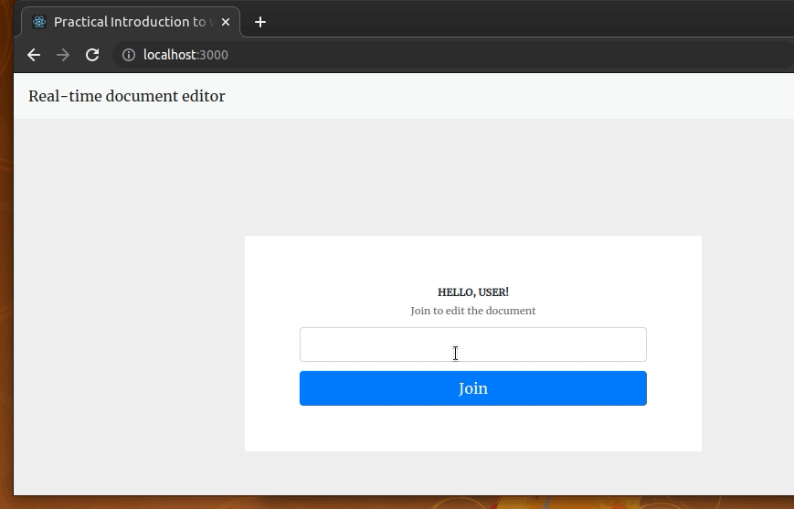

# react-node-websockets-demo
A simple collaborative document editing app built with React and Node



## How to run the app?

```bash
#-- Setup and start the server
cd server
npm install # or yarn install
npm start # or yarn start

#-- Setup and start the client
cd client
npm install # or yarn install
npm start # or yarn start
```

## License
[MIT](LICENSE)

## Credits
This project was initially forked from the [`AvanthikaMeenakshi/node-websockets`](https://github.com/AvanthikaMeenakshi/node-websockets) repository and implemented according to [this LogRocket blog post](https://blog.logrocket.com/websockets-tutorial-how-to-go-real-time-with-node-and-react-8e4693fbf843/).

Credit goes to the original author [Avanthika Meenakshi](https://blog.logrocket.com/author/avanthikameenakshi/) who developed the original version.

## Changelog

This project has the following changes compared to the original project.

- Upgraded the React version to 18
- Refactored the client app using multiple functional components
- Refactored the server app using multiple functions and handlers
- Used better dependencies and implementations (i.e., `ws` instead of `websocket`, `uuid` instead of `Math.random`, etc.)
- Used the `react-use-websocket` hook/library instead of directly using the inbuilt WebSockets browser API.
- Fixed several bugs
